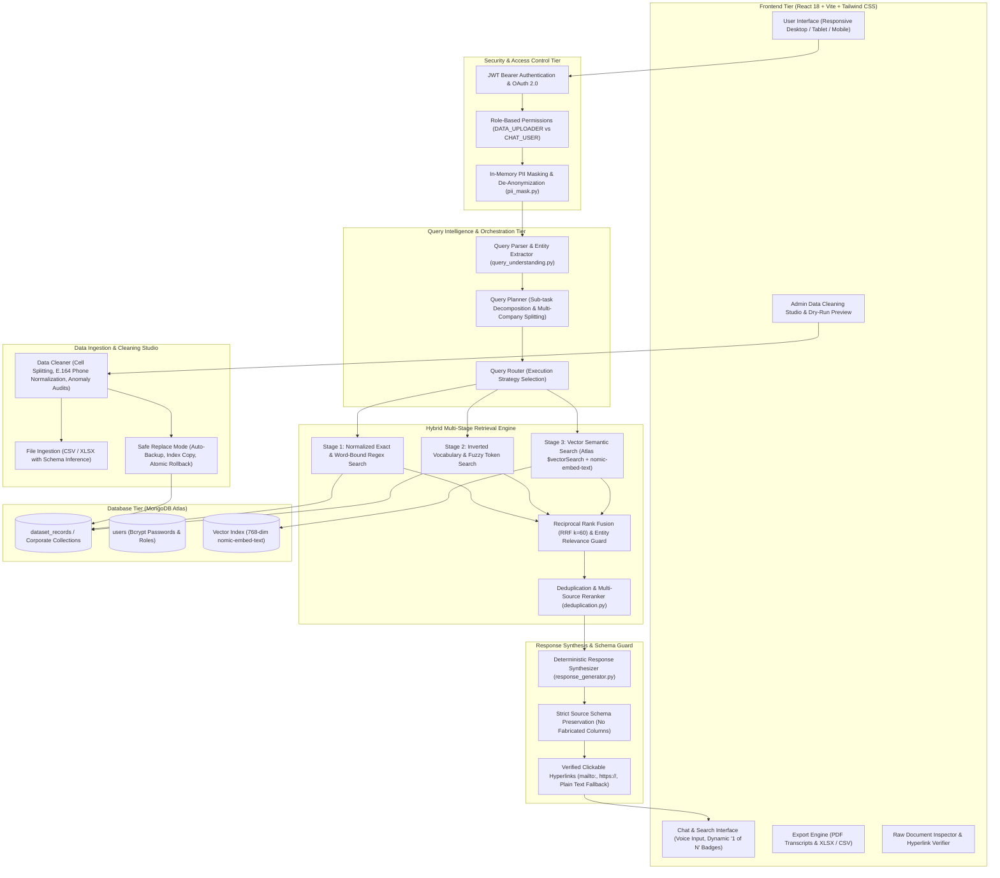

# Calispec AI — Enterprise Company & Contact Search Chatbot

An enterprise-grade, full-stack AI search assistant engineered for querying, retrieving, inspecting, and managing **company and contact intelligence** across **MongoDB Atlas** collections and uploaded Excel/CSV datasets.

The platform combines **Natural Language Query Understanding**, **Intelligent Query Planning**, **Hybrid Multi-Stage Search (Exact Regex + Inverted Index + Atlas Vector Search)**, **Deterministic Response Synthesis**, **Role-Based Access Control (RBAC)**, **In-Memory PII Masking**, **Admin Data Cleaning Studio**, and a **Fully Responsive Dark Glassmorphic React UI**.

---

## 🏛️ System Architecture



---

## 🔍 Detailed Tier-by-Tier Breakdown

### 1. Presentation & Interaction Tier (`frontend/src/`)
- **Responsive Workspace Layout (`App.jsx`, `Sidebar.jsx`)**: Fluid CSS Flexbox/Grid responsive system adapting across large screens, laptops, tablets, and mobile phones with smooth drawer transitions and backdrop blur.
- **Enterprise Design System (`index.css`)**: Dark glassmorphic metrology aesthetic featuring HSL color palettes, cyber-cyan accents, customized scrollbars, and accessible typography.
- **Dynamic Result Cards (`ChatMessage.jsx`, `ResultCard.jsx`)**: 
  - Dynamic **`1 of N`** counter badge in the top right of each record card for easy navigation.
  - Interactive metadata pills, copy-to-clipboard actions, and raw JSON document inspector (`DocumentInspectorModal.jsx`).
  - **Smart Hyperlink Handler**: Formats valid email addresses (`mailto:`) and verified URLs (`target="_blank"`) as clickable links; renders missing or invalid links as clean plain text without broken hyperlinks.
- **Multimodal & Export Suite**:
  - Voice dictation with browser speech recognition.
  - One-click branded PDF transcript export (`jsPDF` + `jspdf-autotable`).
  - Excel (`.xlsx`) and CSV table export with search result preservation.
- **Admin In-Place Data Cleaning Studio (`CleaningReportView.jsx`, `CleanExistingDataModal.jsx`)**: Multi-tab visual inspection showing anomaly summaries, proposed corrections, and dry-run preview before committing to database.

---

### 2. Security, Authentication & Privacy Shield (`backend/app/routes/auth.py`, `backend/app/services/auth.py`)
- **Role-Based Access Control (RBAC)**:
  - `CHAT_USER`: Querying, natural language searching, and exporting.
  - `DATA_UPLOADER` / `ADMIN`: File upload (CSV/XLSX), dataset deletion, and in-place database cleaning/replacement.
- **JWT Bearer Authentication**: Secure HMAC-SHA256 tokens with verified claims and configurable expiry (`ACCESS_TOKEN_EXPIRE_MINUTES`).
- **OAuth 2.0 Integration**: Google OAuth redirect and callback support alongside local email/password authentication (Bcrypt hashed).
- **In-Memory PII Masking (`pii_mask.py`)**: Automatic identification and redaction of sensitive identifiers prior to query processing, with deterministic re-hydration on output.
- **Air-Gapped Privacy Mode (`PRIVACY_MODE=true`)**: Enforces zero external API calls for LLMs or embeddings, relying purely on local offline regex, inverted indexing, and deterministic synthesis.

---

### 3. Query Intelligence & Planning Engine (`backend/app/services/`)
- **Query Parser & Understanding (`query_understanding.py`, `query_parser.py`)**: 
  - Regex and heuristic extraction for Company Names, Contact Persons, Locations/Cities, Roles/Designations, Phone Numbers, and Emails.
- **Query Planner (`query_planner.py`)**: 
  - Decomposes multi-intent and multi-company comparative queries into distinct, ranked sub-tasks (e.g., *"Find CEO at Calispec and HR at Acme"* $\rightarrow$ Task 1: `Calispec (CEO)` + Task 2: `Acme (HR)`).
- **Query Router (`query_router.py`)**: 
  - Intelligently chooses between structured MongoDB queries, token vocabulary matching, or semantic vector retrieval based on query complexity.

---

### 4. Hybrid Multi-Stage Retrieval Engine (`backend/app/services/`)
- **Stage 1 — Normalized Exact & Word-Bound Regex (`mongo_search.py`)**:
  - High-precision search matching against normalized fields (`norm_company_name`, `norm_person_name`, `norm_city`).
  - Strict word-boundary guards preventing false-positive substring matches (e.g., matching "Apple" without capturing "Pineapple").
- **Stage 2 — High-Speed Inverted Index (`contact_search.py`)**:
  - Token-level in-memory inverted index providing sub-millisecond retrieval with fuzzy typo tolerance.
- **Stage 3 — Vector Semantic Search (`vector_search.py`, `embeddings.py`)**:
  - 768-dimensional vector embeddings generated using `nomic-embed-text` via Ollama.
  - Integrated with MongoDB Atlas `$vectorSearch` index for contextual and synonym-aware semantic search.
- **Reciprocal Rank Fusion (RRF $k=60$) & Relevance Guard (`retrieval_service.py`)**:
  - Blends keyword and semantic candidate rankings.
  - Applies **Exact Entity Guarding**: Ensures verified exact company name matches take priority over distant semantic candidates.
- **Multi-Source Deduplication (`deduplication.py`, `source_resolver.py`)**:
  - Merges duplicate contacts across sheets or collections while maintaining provenance records.

---

### 5. Deterministic Response Synthesizer & Schema Guard (`response_generator.py`)
- **Strict Source Schema Preservation**:
  - Output dynamically renders **only** the actual columns present in each source document.
  - Never fabricates placeholder columns or generates artificial *"Not Available"* fields.
- **Source Attribution**:
  - Each record or group clearly attributes the originating `Source File`, `Collection`, `Sheet`, and `Row`.
  - Multi-source results are cleanly separated with visual markdown dividers (`---`).

---

### 6. Data Ingestion & In-Place Cleaning Studio (`data_cleaner.py`, `existing_data_cleaner.py`)
- **Intelligent Field Mapping (`concept_mapper.py`)**:
  - Automatically recognizes varying column headers (`Org Name`, `Comp. Name`, `Tel`, `Mob`, `Mail ID`) and maps them to unified concepts.
- **Data Normalization Engine**:
  - Splits multi-contact and multi-phone cells.
  - Standardizes international telephone numbers to E.164 format.
  - Cleans malformed email addresses and trims whitespace anomalies.
- **Safe Database Replacement Pipeline**:
  - Generates atomic dry-run preview cached with 15-minute TTL (`preview_cache.py`).
  - Exports comprehensive multi-sheet Excel audit reports (`.xlsx`).
  - Supports side-by-side creation (`new_collection`) or verified `replace` mode (requiring confirmation typing, automatic backup collection creation `_backup_<timestamp>`, index preservation, and instant rollback on error).

---

## 🛠️ Technology Stack

| Component | Technology / Library | Description |
| :--- | :--- | :--- |
| **Frontend Framework** | React 18, Vite | High-performance SPA with fast HMR |
| **Styling & Icons** | Tailwind CSS, Material Symbols | Glassmorphic dark UI, responsive design |
| **Document Export** | jsPDF, jsPDF-AutoTable | PDF transcript and audit report generator |
| **Backend Framework** | Python 3.10+, FastAPI, Uvicorn | Async ASGI backend with OpenAPI docs |
| **Validation & Serialization** | Pydantic v2 | Strict schema validation |
| **Database & Vector Search**| MongoDB Atlas, PyMongo, Motor | Document store + `$vectorSearch` index |
| **Embeddings & LLM** | Ollama (`nomic-embed-text`, 768-d) | Local, privacy-first vector embeddings |
| **Authentication & RBAC** | PyJWT, Bcrypt, Google OAuth | Token-based auth with granular user roles |
| **Data Processing** | Pandas, NumPy, OpenPyXL | Excel/CSV ingestion, auditing, and cleaning |

---

## 📂 Project Structure

```text
Calispec chatbot project/
├── backend/
│   ├── app/
│   │   ├── routes/
│   │   │   ├── auth.py                 # /api/auth login, Google OAuth, me, logout
│   │   │   ├── chat.py                 # /api/chat, /api/search, /api/suggestions
│   │   │   ├── datasets.py             # /api/datasets upload, list & delete
│   │   │   └── admin_clean.py          # /api/admin/clean preview, report & apply
│   │   ├── services/
│   │   │   ├── auth.py                 # JWT token minting, password hashing & RBAC
│   │   │   ├── pii_mask.py             # PII masking & de-anonymization
│   │   │   ├── query_understanding.py  # Structured query & entity extraction
│   │   │   ├── query_planner.py        # Multi-intent query planner & task splitter
│   │   │   ├── query_router.py         # Search execution router
│   │   │   ├── retrieval_service.py    # Hybrid retrieval, RRF merge & relevance guard
│   │   │   ├── multi_stage_search.py   # Multi-stage exact, token, and semantic search
│   │   │   ├── mongo_search.py         # MongoDB queries & structured filters
│   │   │   ├── vector_search.py        # Atlas vector search & cosine similarity
│   │   │   ├── embeddings.py           # nomic-embed-text embedding generator
│   │   │   ├── response_generator.py   # Deterministic synthesizer & link parser
│   │   │   ├── mongo_dataset.py        # Dataset indexing & collection manager
│   │   │   ├── data_cleaner.py         # Offline cleaning engine & anomaly detector
│   │   │   ├── existing_data_cleaner.py# MongoDB collection cleaning & safe backup
│   │   │   ├── preview_cache.py        # In-memory dry-run preview TTL cache
│   │   │   ├── contact_search.py       # High-speed inverted index search
│   │   │   ├── concept_mapper.py       # Column concept mapping engine
│   │   │   ├── file_parser.py          # Multi-format CSV/XLSX parser
│   │   │   └── source_resolver.py      # Source document provenance tracking
│   │   ├── utils/
│   │   │   ├── normalization.py        # Name, phone, email & city normalization
│   │   │   └── deduplication.py        # Multi-source aware record deduplication
│   │   ├── config.py                   # Central environment & privacy configuration
│   │   ├── database.py                 # MongoDB connection & index initializer
│   │   ├── main.py                     # FastAPI application entry & CORS middleware
│   │   └── schemas.py                  # Pydantic request and response models
│   ├── scripts/
│   │   ├── manage_users.py             # User provisioning & role assignment CLI
│   │   ├── clean_mongodb.py            # CLI database cleaner & backup manager
│   │   ├── clean_dataset.py            # CLI spreadsheet batch cleaner
│   │   ├── generate_embeddings.py      # Batch vector embedding generator
│   │   └── inspect_and_migrate_db.py   # Schema inspector & migration tool
│   ├── tests/                          # Automated unit and integration test suite
│   ├── requirements.txt                # Backend Python dependencies
│   ├── README.md                       # Backend specific documentation
│   └── .env.example                    # Backend environment configuration template
│
├── frontend/
│   ├── src/
│   │   ├── components/
│   │   │   ├── ChatMessage.jsx         # Message bubbles, markdown link parser, cards & PDF export
│   │   │   ├── ResultCard.jsx          # Formatted record card with dynamic "1 of N" counter
│   │   │   ├── Sidebar.jsx             # Responsive drawer navigation & chat history
│   │   │   ├── FileUploadModal.jsx     # Dataset upload dialog (CSV/XLSX) with clean preview
│   │   │   ├── CleanExistingDataModal.jsx # Admin in-place MongoDB collection cleaning
│   │   │   ├── CleaningReportView.jsx  # Multi-tab data clean report viewer
│   │   │   ├── DataView.jsx            # Tabular dataset inspection view
│   │   │   ├── DatasetSelector.jsx     # Active dataset filtering dropdown
│   │   │   ├── LoginModal.jsx          # Uploader authentication dialog
│   │   │   ├── DocumentInspectorModal.jsx # Raw document metadata inspection modal
│   │   │   └── CalispecLogo.jsx        # Responsive vector brand icon & typography
│   │   ├── utils/
│   │   │   └── reportPdfExporter.js    # Client-side PDF audit report generator
│   │   ├── api.js                      # API client with JWT bearer handling
│   │   ├── App.jsx                     # Root application layout, theme state & RBAC
│   │   ├── main.jsx                    # Application entry point
│   │   └── index.css                   # Responsive layout & dark glassmorphic styling
│   ├── package.json                    # Frontend dependencies
│   └── vite.config.js                  # Vite configuration
│
├── requirements.txt                    # Root requirements pointer
├── .gitignore
└── README.md
```

---

## 🚀 Getting Started

### Prerequisites

- **Python**: Version 3.10 or higher
- **Node.js**: Version 18 or higher (with `npm`)
- **MongoDB Atlas**: Cluster URI with read/write permissions
- *(Optional)* **Ollama**: For local vector embeddings (`ollama pull nomic-embed-text`)

---

### 1. Backend Setup

1. Navigate to the `backend/` directory:
   ```powershell
   cd backend
   ```

2. Create and activate a Python virtual environment:
   ```powershell
   python -m venv venv
   .\venv\Scripts\Activate.ps1
   ```

3. Install dependencies:
   ```powershell
   python -m pip install -r requirements.txt
   ```

4. Configure environment variables:
   - Copy `.env.example` to `.env`:
     ```powershell
     cp .env.example .env
     ```
   - Update `backend/.env` with your credentials:
     ```env
     # MongoDB Connection
     MONGODB_URI=mongodb+srv://<username>:<password>@<cluster>.mongodb.net/?retryWrites=true&w=majority
     MONGODB_DB_NAME=calispec
     MONGODB_COLLECTIONS=dataset_records, collection_1, collection_2

     # Privacy & AI Settings
     PRIVACY_MODE=true
     OLLAMA_BASE_URL=http://localhost:11434
     EMBEDDING_MODEL=nomic-embed-text

     # Authentication & Security
     JWT_SECRET=your-super-secret-jwt-key
     JWT_ALGORITHM=HS256
     ACCESS_TOKEN_EXPIRE_MINUTES=10080

     # Server Configuration
     FRONTEND_URL=http://localhost:5173
     PORT=8000
     ```

5. Launch the FastAPI server:
   ```powershell
   uvicorn app.main:app --reload --port 8000
   ```

   - **Interactive API Docs (Swagger UI)**: [http://localhost:8000/docs](http://localhost:8000/docs)
   - **Health Check**: [http://localhost:8000/health](http://localhost:8000/health)

---

### 2. Frontend Setup

1. Open a new terminal and navigate to `frontend/`:
   ```powershell
   cd frontend
   ```

2. Install Node packages:
   ```powershell
   npm install
   ```

3. Start the Vite development server:
   ```powershell
   npm run dev
   ```

4. Open your browser at **[http://localhost:5173](http://localhost:5173)**.

---

## 📡 API Reference

### 🔐 Authentication (`/api/auth`)
| Method | Endpoint | Description | Role Required |
| :--- | :--- | :--- | :--- |
| `POST` | `/api/auth/login` | Authenticate credentials and receive JWT | Public |
| `GET` | `/api/auth/google` | Initiate Google OAuth 2.0 flow | Public |
| `GET` | `/api/auth/google/callback`| Google OAuth redirect callback | Public |
| `GET` | `/api/auth/me` | Fetch authenticated user profile & role | Authenticated |
| `POST` | `/api/auth/logout` | Terminate session | Authenticated |

### 💬 Chat & Search (`/api/`)
| Method | Endpoint | Description | Role Required |
| :--- | :--- | :--- | :--- |
| `POST` | `/api/chat` | Main hybrid search and query synthesis endpoint | Public / User |
| `GET` | `/api/search` | Targeted field search (`company_name`, `person`, `city`, `designation`) | Public / User |
| `GET` | `/api/suggestions` | Instant search query auto-completions | Public / User |

### 📁 Dataset Management (`/api/datasets`)
| Method | Endpoint | Description | Role Required |
| :--- | :--- | :--- | :--- |
| `GET` | `/api/datasets` | List indexed datasets, row counts, and metadata | Public / User |
| `POST` | `/api/datasets/upload` | Upload & index new `.xlsx` or `.csv` files | `DATA_UPLOADER` |
| `DELETE`| `/api/datasets/{id}` | Delete uploaded dataset and its indexed documents | `DATA_UPLOADER` |
| `GET` | `/api/collections` | List available MongoDB collections and counts | Public / User |

### 🧹 Admin Data Cleaning Studio (`/api/admin/clean`)
| Method | Endpoint | Description | Role Required |
| :--- | :--- | :--- | :--- |
| `GET` | `/api/admin/clean/collections` | List MongoDB collections with uncleaned record counts | `DATA_UPLOADER` |
| `POST` | `/api/admin/clean/preview` | In-memory dry-run cleaning preview & audit summary | `DATA_UPLOADER` |
| `GET` | `/api/admin/clean/preview/{id}/report.xlsx` | Download multi-sheet Excel audit report | `DATA_UPLOADER` |
| `POST` | `/api/admin/clean/apply` | Commit cleaning (`new_collection` or verified `replace`) | `DATA_UPLOADER` |
| `GET` | `/api/admin/clean/status` | Quick healthcheck on uncleaned record status | Public / User |

---

## 🧪 Testing & Verification

The project includes unit, integration, and security tests:

```powershell
cd backend

# Run entire test suite
python -m unittest discover tests

# Run specific test modules
python -m unittest tests/test_rbac_security.py
python -m unittest tests/test_source_schema_preservation.py
python -m unittest tests/test_query_parser.py
```

---

## 🛡️ License

Private Enterprise Application — All Rights Reserved © Calispec AI.
